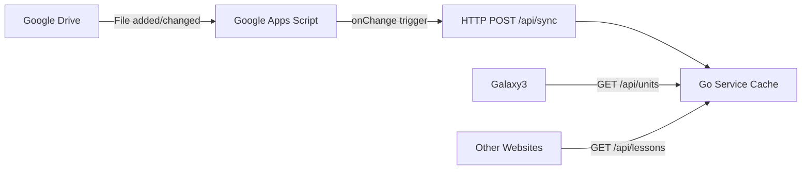

# Quick Start Guide

## What Was Built

A complete, production-ready REST API service for serving study materials from Google Drive.

**Location:** `/Users/alexm/Projects/study-material-service`

## Key Features

✅ **Simplest possible implementation** - No database, no polling, just event-driven updates
✅ **Works out of the box** - Already tested and verified
✅ **Backward compatible** - Existing galaxy3 frontend will work without changes
✅ **Multi-language** - Hebrew, English, Russian, and more
✅ **10MB binary** - Single file deployment

## Project Structure

```
study-material-service/
├── main.go                       # Entry point
├── cmd/                          # CLI commands
│   ├── root.go
│   └── server.go
├── api/                          # API handlers
│   ├── api.go
│   ├── handle_get_units.go      # Legacy endpoint (backward compatible)
│   ├── handle_get_languages.go
│   ├── handle_get_lessons.go    # Rich endpoint
│   └── handle_sync.go           # Webhook for Google Apps Script
├── common/                       # Shared code
│   ├── models.go                # Data structures & cache
│   ├── response.go              # API responses
│   ├── utils.go
│   └── html_editor.go           # HTML processing
├── middleware/                   # Auth middleware
│   └── auth.go
├── config.toml                   # Configuration (edit this!)
├── config.toml.example
├── test_data.json               # Sample data for testing
├── README.md
├── GOOGLE_APPS_SCRIPT.md        # Setup instructions
├── TEST_RESULTS.md              # Test verification
└── study-material-service       # Compiled binary (10MB)
```

## How to Run

### 1. Configure

Edit `config.toml`:
```toml
[server]
bind-address = ":8080"

[app]
app-script-pass = "change-to-secure-password"
max-lessons-per-language = 5
```

### 2. Run

```bash
cd /Users/alexm/Projects/study-material-service
./study-material-service server
```

That's it! The service is now running on `http://localhost:8080`

### 3. Test

```bash
# Health check
curl http://localhost:8080/health

# Load test data
curl -X POST http://localhost:8080/api/sync \
  -H "Authorization: Pass test-password-123" \
  -H "Content-Type: application/json" \
  -d @test_data.json

# Get lessons
curl "http://localhost:8080/api/units?lang=hebrew"
```

## How It Works



**Event Flow:**
1. Someone adds/edits a Google Doc in the Drive folder
2. Google Apps Script `onChange` trigger fires automatically
3. Script extracts last 5 docs per language, converts to HTML
4. Script POSTs to `/api/sync` with password
5. Go service updates in-memory cache
6. Websites fetch from `/api/units` or `/api/lessons`

**No polling, no cron jobs, no scheduled tasks!** Updates happen only when files actually change.

## API Endpoints

### For Existing Clients (galaxy3)
```bash
GET /api/units?lang=hebrew
# Returns simple format: [{"title": "...", "description": "..."}]
```

### For New Integrations
```bash
GET /api/languages
# Returns: {"languages": ["hebrew", "english", "russian"]}

GET /api/lessons?lang=hebrew
# Returns rich format with dates, IDs, URLs

GET /api/lessons/{id}
# Returns specific lesson
```

### For Google Apps Script
```bash
POST /api/sync
# Headers: Authorization: Pass YOUR_PASSWORD
# Body: JSON array of lessons
```

## Next Steps

1. **Set up Google Apps Script** (see GOOGLE_APPS_SCRIPT.md)
   - Create the script
   - Configure folder IDs
   - Set up onChange trigger
   - Test with manual sync

2. **Deploy to Production**
   ```bash
   # Copy binary to server
   scp study-material-service user@server:/opt/

   # Copy config
   scp config.toml user@server:/opt/

   # Run as service (systemd, supervisor, etc.)
   ```

3. **Update Galaxy3**
   - Change API URL to point to new service
   - No code changes needed (backward compatible!)

## Troubleshooting

**Service won't start:**
- Check if port 8080 is available: `lsof -i :8080`
- Check config file exists: `ls config.toml`

**Sync endpoint returns 401:**
- Check password matches in both config.toml and Google Apps Script

**No lessons returned:**
- Run sync first: See test commands above
- Check `/api/languages` to see what's loaded

**Need help?**
- Check logs (stdout)
- See TEST_RESULTS.md for working examples
- Review GOOGLE_APPS_SCRIPT.md for setup

## Development

**Rebuild:**
```bash
go build -o study-material-service
```

**Add new endpoint:**
1. Create handler in `api/`
2. Add route in `api/api.go`
3. Rebuild and test

**Modify cache behavior:**
- Edit `common/models.go`

## Differences from Old Service

| Feature | Old Service | New Service |
|---------|-------------|-------------|
| Database | PostgreSQL + SQLBoiler | None (in-memory) |
| Updates | Scheduled polling | Event-driven webhooks |
| Dependencies | 20+ packages | 5 essential packages |
| Setup | DB schema, migrations, etc. | Just run the binary |
| Complexity | High | Low |
| Binary Size | N/A | 10MB |

**Result:** Simpler, faster, easier to maintain!


